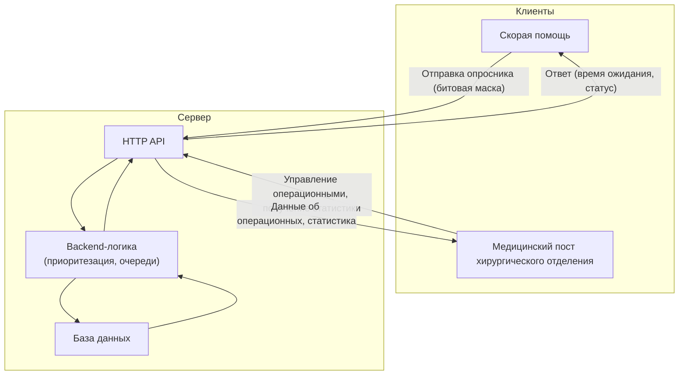

# Emergency (Hospital) Triage System

Backend-сервис для распределения пострадавших по операционным

**⚠️ Предупреждение**
>Проект создан исключительно в образовательных целях и для демонстрации навыков разработки на `C++` (**backend**).
>Алгоримты медицинской сортировки (триажа) и медицинская логика являются упрощёнными и **не предназначены для реального использования в медицинской практике**, принятия клинических решений или диагностики.
>Для реального здравоохранения требуются сертифицированные системы, прошедшие клинические испытания.

## Технологии
- C++
- cpp-httplib (HTTP сервер)
- nlohmann/json
- SQLite (в будущем)
- Google Test
- CMake
- GitHub Actions (CI)

## Этапы реализации сервиса:
**1. In-memory сервер с хранением данных в STL контейнерах**
Статус: *реализуется*

**2. Добавление логики приоритезации пострадавших и очереди в операционные (MVP)**
Статус: *запланирован к реализации*

**3. Интеграция с базой данных (SQLite)**
Статус: *запланирован к реализации*

**4. Реализация многопоточности**
Статус: *запланирован к реализации*

**5. Применение Docker, обработка статистики**
Статус: *запланирован к реализации*

## Версионирование

Проект использует семаническое версионирование.Теги создаются по мере завершения значимых этапов.

| Тег | Описание |
|-----|----------|
| `v0.1.0` | Скелет проекта (CMake, CI, заглушки, документация) |
| `v0.1.1` | Добавлен дисклеймер |

Актуальный список тегов: [ссылка на теги](https://github.com/V1aDD05/emergency-triage-backend/tags)

## Концепция и составляющие сервиса
Сервис для оптимизации распределения пострадавших по операционным в больнице. 

### Обобщённая схема сервиса

### Концепция сервиса в целом
**1. Клиент "карета скорой помощи"**
Предоставляет врачу опросник по состоянию пострадавшего ("есть кровотечение?", "частота сердечных сокращений более 20 в минуту?"). По опроснику формируется битовая маска статуса пострадавшего. Битовая маска, пол (опционально) и возраст (опционально) отправляются серверу.
*Возможные улучшения: сбор и передача контакных данных пострадавшего, сведений о травмах и хронических заболеваниях.*

**2. Клиент "медицинский пост хирургического отделения"**
Отображает информацию о статусе операционных (заняты или свободны), оценочное время до окончания операции.
*Возможные улучшения: возможность получить статистику операционных бригад (смертность, и т.п.)*

**3. Backend сервер**
Реализует логику приоритезации пострадавших по операционным.  Оценивает время ожидания.
*Возможные улучшения: При наличии различных типов операционных, определяет тип требуемой операционной. Определяет статистику бригады*

**4. HTTP API**
Обрабатывает запросы от клиентов "карета скорой помощи" и "медицинский пост хирургического отделения";

**5. База данных**
Хранит приоритизированную очередь пациентов, статус операционных.
*Возможные улучшения: хранение статистических данных*

### Реализуемая составляющая сервиса
- HTTP API;
- Backend сервер;
- База данных;

## Документация
- [Модели данных](docs/data_models.md);
- [Описание компонентов сервера (API, хранилище, логика) и взаимосвязей](docs/architecture.md);
- [Дополнительные идеи и возможные улучшения, не привязанные к этапам проекта](docs/ideas.md);

## Об авторе
- Профиль на GitHub: https://github.com/V1aDD05
- Резюме на hh.ru: https://hh.ru/resume/f983f03bff101c08bd0039ed1f45615759706f