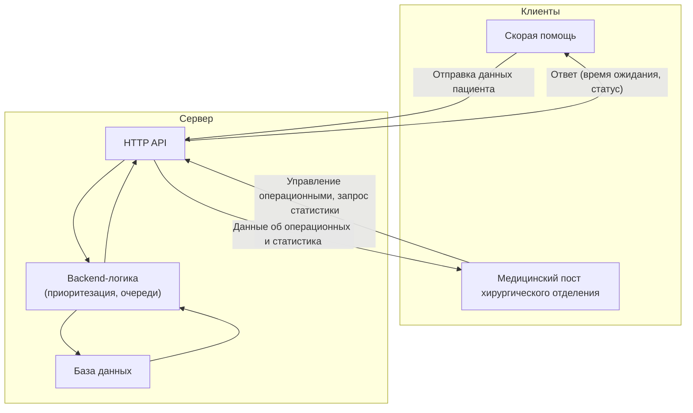

# Emergency (Hospital) Triage System

Backend-сервис для распределения пострадавших по операционным

**⚠️ Предупреждение**
>Проект создан исключительно в образовательных целях и для демонстрации навыков разработки на `C++` (**backend**).
>Алгоритмы медицинской сортировки (триажа) и медицинская логика являются упрощёнными и **не предназначены для реального использования в медицинской практике**, принятия клинических решений или диагностики.
>Для реального здравоохранения требуются сертифицированные системы, прошедшие клинические испытания.

## Содержание
- [Технологии](#технологии)
- [Концепция и составляющие сервиса](#концепция-и-составляющие-сервиса)
- [Этапы реализации сервиса](#этапы-реализации-сервиса)
- [Версионирование](#версионирование)
- [Ветки](#ветки)
- [Стиль коммитов](#стиль-коммитов)
- [Документация](#документация)
- [Благодарности](#благодарности)
- [Об авторе](#об-авторе)

## Технологии
- C++
- cpp-httplib (HTTP сервер)
- nlohmann/json
- SQLite (в будущем)
- Google Test
- CMake
- GitHub Actions (CI)

## Концепция и составляющие сервиса
Сервис для оптимизации распределения пострадавших по операционным в больнице. Основной фокус на backend логике

### Обобщённая схема сервиса

```mermaid
flowchart TD
    subgraph Клиенты
        A[Скорая помощь]
        B[Медицинский пост хирургического отделения]
    end

    subgraph Сервер
        C[HTTP API]
        D["Backend-логика\n(приоритезация, очереди)"]
        E[База данных]
    end

    A -- "Отправка данных пациента" --> C
    B -- "Управление операционными, запрос статистики\n \n \n" --> C
    C --> D
    D --> E
    E --> D
    D --> C
    C -- "Ответ (время ожидания, статус)" --> A
    C -- "Данные об операционных и статистика" --> B

```

### Концепция сервиса в целом
**1. Клиент "карета скорой помощи"**
Формирует JSON файл с данными о пациенте (характер повреждений, пол, возраст, и т.д.), отправляет запрос на HTTP API.
*Возможные улучшения: сбор и передача контактных данных пострадавшего, сведений о травмах и хронических заболеваниях.*

**2. Клиент "медицинский пост хирургического отделения"**
Отображает информацию о статусе операционных (заняты или свободны), оценочное время до окончания операции.
*Возможные улучшения: возможность получить статистику операционных бригад (смертность, и т.п.)*

**3. Backend сервер (бизнес-логика)**
Реализует вычисление приоритета помощи пострадавшему. Распределяет пострадавших по операционным на основе приоритета.  Оценивает время ожидания пациентом операции.
*Возможные улучшения: При наличии различных типов операционных, определяет тип требуемой операционной. Определяет статистику бригады*

**4. HTTP API**
Обрабатывает запросы от клиентов "карета скорой помощи" и "медицинский пост хирургического отделения";

**5. База данных**
Хранит приоритизированную очередь пациентов, статус операционных.
*Возможные улучшения: хранение статистических данных*

### Реализуемая составляющая сервиса
- HTTP API;
- Backend сервер;
- База данных;
- Простейшие клиенты.

## Этапы реализации сервиса
**1. "Скелет" проекта (CMake, CI, заглушки, документация, простейшие клиенты)**
Статус: *реализуется*

**2. In-memory сервер с хранением данных в STL контейнерах**
Статус: *запланирован к реализации*

**3. Добавление логики приоритезации пострадавших и очереди в операционные (MVP)**
Статус: *запланирован к реализации*

**4. Интеграция с базой данных (SQLite)**
Статус: *запланирован к реализации*

**5. Реализация многопоточности**
Статус: *запланирован к реализации*

**6. Применение Docker**
Статус: *запланирован к реализации*

**7. Обработка статистики**
Статус: *запланирован к реализации*

## Версионирование
Проект использует семантическое версионирование. Теги создаются по мере завершения значимых этапов.

| Тег | Описание |
|-----|----------|
| `v0.1.0` | Скелет проекта (CMake, CI, заглушки, документация) |

Актуальный список тегов: [ссылка на теги](https://github.com/V1aDD05/emergency-triage-backend/tags)

## Ветки
Следуем [Git Flow](https://nvie.com/posts/a-successful-git-branching-model/) с дополнениями:
- `main` - стабильная ветка для релизов (в пет-проекте сюда попадают результаты крупных этапов через release/*).
- `dev` - основная ветка разработки;
- `stage/*` - для крупных этапов (например, `stage/1`, `stage/2`). Создаются от `dev`, после завершения сливаются обратно в `dev`.
- `bugfix/*` - для исправления ошибок.
- `release/*` - подготовка релиза. Создаются от `dev`, сливаются в `main` и `dev`.
- `hotfix/*` - для срочных исправлений. Сливаются в `main` и `dev`.

## Стиль коммитов
Начиная с `v0.1.0` коммиты следуют [Conventional Commits](https://www.conventionalcommits.org/en/v1.0.0/), конфигурацию [@commitlint/config-conventional](https://www.npmjs.com/package/@commitlint/config-conventional). Ниже приведена таблица применяемых типов:

| Тип | Характер изменения | Описание |
|-----|--------------------|----------|
| **feat** | Новая функциональность | Добавление новой функции или возможности |
| **fix** | Исправление ошибки | Исправление бага в коде |
| **docs** | Документация | Изменения, касающиеся только документации (в том числе - комментарии в коде) |
| **refactor** | Рефакторинг | Изменение кода, которое не исправляет ошибку и не добавляет новую функцию (например, переименование переменной, вынос функции) |
| **perf** | Производительность | Изменения, направленные на улучшение производительности (например, оптимизация алгоритма, реструктуризация данных) |
| **test** | Тесты | Добавление новых или исправление существующих тестов |
| **build** | Система сборки | Изменения, затрагивающие систему сборки или внешние зависимости (например, обновление `CMakeLists.txt` или версии библиотеки) |
| **ci** | Непрерывная интеграция (CI) | Изменения в конфигурации CI (например, обновление `.github/workflows/ci.yml`) |
| **chore** | Обслуживание | Другие тривиальные изменения, не затрагивающие исходный код или тесты (например, обновление `.gitignore`) |
| **style** | Стиль кода | Изменения, не влияющие на смысл кода (форматирование, пробелы, и т.д.) |
| **revert** | Откат изменений | Отмена одного из предыдущих коммитов |

## Документация
- [Модели данных](docs/data_models.md);
- [Описание компонентов сервера (API, хранилище, логика) и взаимосвязей](docs/architecture.md);
- [Дополнительные идеи и возможные улучшения, не привязанные к этапам проекта](docs/ideas.md);

## Благодарности
Благодарю [Александра Новака](https://github.com/sonofR9/sonofR9) за ценные советы и ревью кода в рамках pull requests!

## Об авторе
- Профиль на GitHub: https://github.com/V1aDD05
- Резюме на hh.ru: https://hh.ru/resume/f983f03bff101c08bd0039ed1f45615759706f