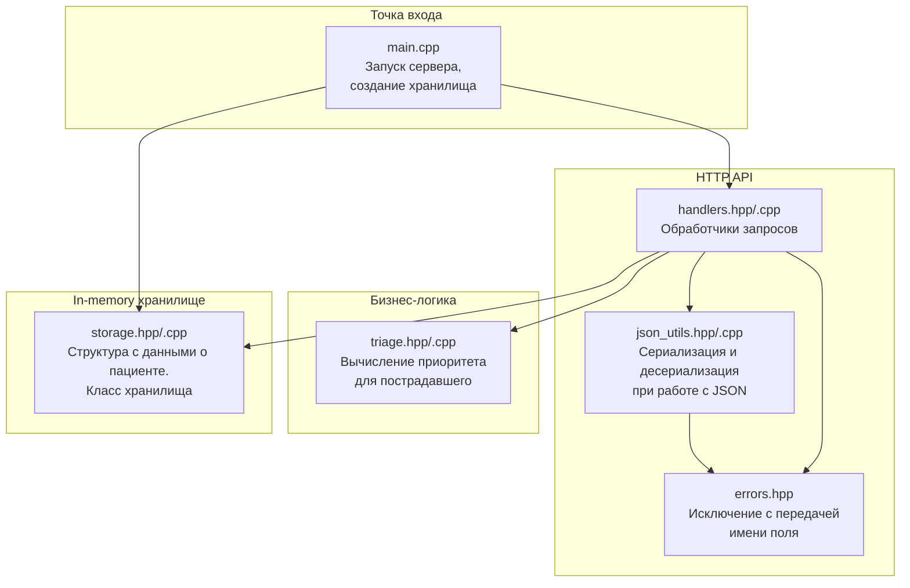

# Описание компонентов сервера

Содержит [визуализацию](#основные-взаимосвязи-в-проекте) файлов и основных взаимосвязей в проекте.
Содержит описание следующих основных компонентов: [хранилища](#хранилище), [API](#http-api).

## Основные взаимосвязи в проекте на этапе 1

## Хранилище
На данном этапе реализовано в виде класса `PatientStorage`, подробнее [см.здесь](src/storage/storage.hpp).

### Поля класса (приватные)
- `nextId_` - поле, хранящее ID, который будет присвоен следующему "пациенту" ( [подробнее о структуре `Patient`](docs/data_models.md));
- `patientsStorage_` - хранилище записей о пациентах. Реализовано как std::unordered_map<int, Patient>, где ключ - ID пациента.

### Публичные методы:
#### `uint32_t addPatient(...)` 

Осуществляет добавление пациента при помощи информации, полученной от клиента "карета скорой помощи". Возвращает присвоенный пациенту ID.

**Входные значения:**

|Название|Тип|Обязательный|Описание|
|--------|---|------------|--------|
|mask|uint32_t|Да|Битовая маска симптомов. Формируется клиентом "карета скорой помощи"|
|priority|uint32_t|Да|Статический приоритет. Формируется [бизнес-логикой](src/core/triage.hpp) на основе `mask` до вызова `addPatient`|
|age|std::optional<uint8_t>|Нет|Возраст пациента. Получаем от клиента "карета скорой помощи"|
|sex|std::optional<Gender>|Нет|Пол пациента. Получаем от клиента "карета скорой помощи"|

**Выходное значение**
`uint32_t` - автоинкрементный ID, формируемый копированием значения поля nextId_ класса `PatientStorage`. Сохраняется в поле id_ структуры `Patient`

#### `std::optional<Patient> getPatient(uint32_t id) const`
Осуществляет передачу информации о конкретном пациенте

**Входное значение:** 
`uint32_t` - ID пациента;

**Выходное значение**
`std::optional<Patient>`. Если пациент с переданным ID найден, возвращает копию записи о пациенте (объекта структуры `Patient`). Иначе возвращает std::nullopt.
Передача *по значению*.

#### `std::vector<Patient> getAllPatients() const`
Осуществляет передачу информации обо всех пациентах в очереди

**Выходное значение**
`std::vector<Patient>` - вектор всех записей о пациентах (объектов структуры `Patient`), имеющихся в хранилище.
Передача *по значению*.

### Примечания
- На данном этапе хранилище реализовано `in-memory`;
- На данном этапе не является потокобезопасным;

## HTTP API

### POST /patients
Создаёт запись о новом пациенте.
Формат запроса и ответа описан в [data_models.md](docs/data_models.md#json-для-запроса-post-patients).
#### Возможные коды:
- **201 (Created)** - пациент успешно создан.
- **400 (Bad Request)** - ошибка в запросе:
    - невалидный JSON;
    - отсутствует обязательное поле "mask";
    - поле "mask" не является целым неотрицательным числом или выходит за пределы `uint32_t`;
    - поле "age" (если указано) не является целым неотрицательным числом или выходит за пределы `uint8_t`;
    - поле "sex"  (если указано) не строкой или имеет значение, отличное от "male"/"female".
- **500 (Internal Server Error)** - внутренняя ошибка сервера (ошибка бизнес-логики или непредвиденное исключение);

---

### GET /patients/{id}
Предоставляет информацию о конкретном пациенте.
Формат запроса и ответа описан в [data_models.md](docs/data_models.md#json-для-запроса-get-patientsid).
#### Возможные коды:
- **200 (OK)** - пациент найден, данные возвращены;
- **400 (Bad Request)** - неверный формат ID (не число, отрицательное, выходит за пределы `uint32_t`);
- **404 (Not Found)** - апциент с указанным ID не существует;
- **500 (Internal Server Error)** - внутренняя ошибка сервера;

---

### GET /patients
Предоставляет информацию обо всех пациентах.
Формат ответа описан в [data_models.md](docs/data_models.md#json-для-ответа-на-запрос-get-patients).
#### Возможные коды:
- **200 (OK)** - возвращён массив пациентов (возможно, пустой);
- **500 (Internal Server Error)** - внутренняя ошибка сервера;

---

