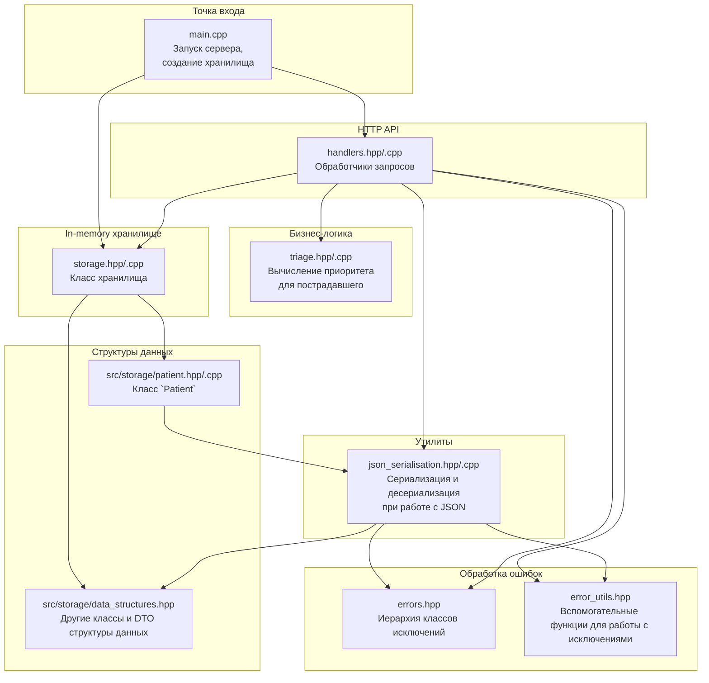

# Описание компонентов сервера

Содержит [визуализацию](#основные-взаимосвязи-в-проекте) файлов и основных взаимосвязей в проекте.
Содержит описание следующих основных компонентов: [хранилища](#хранилище), [API](#http-api).

## Основные взаимосвязи в проекте на этапе 1

```mermaid
flowchart TD
    subgraph "Точка входа"
        M["main.cpp\nЗапуск сервера,\nсоздание хранилища"]
    end

    subgraph "HTTP API"
        A["handlers.hpp/.cpp\nОбработчики запросов"]
        
    end

    subgraph "Бизнес-логика"
        D["triage.hpp/.cpp\nВычисление приоритета\nдля пострадавшего"]
    end

    subgraph "In-memory хранилище"
        E["storage.hpp/.cpp\nКласс хранилища"]
    end

    subgraph "Структуры данных"
        F["src/storage/data_structures.hpp\nДругие классы и DTO структуры данных"]
        G["src/storage/patient.hpp/.cpp\nКласс `Patient`"]
    end

    subgraph "Утилиты"
        B["json_serialisation.hpp/.cpp\nСериализация и десериализация\nпри работе с JSON"]
    end

    subgraph "Обработка ошибок"
        C["errors.hpp\nИерархия классов исключений"]
        H["error_utils.hpp\nВспомогательные функции для работы с исключениями"]
    end

    M --> A
    M --> E
    A --> B
    B --> C
    A --> C
    A --> D
    A --> E
    E --> F
    E --> G
    B --> F
    G --> B
    A --> H
    B --> H

```

## Хранилище
Базовый класс - `IPatientStorage`. От него на данном этапе наследуется класс in-memory хранилища `PatientStorage`, подробнее [см.здесь](src/storage/storage.hpp).

### Поля класса (приватные)
- `nextId_` - поле, хранящее ID, который будет присвоен следующему "пациенту" ( [подробнее о структуре `Patient`](docs/data_models.md));
- `patientsStorage_` - хранилище записей о пациентах. Реализовано как std::unordered_map<uint32_t, Patient>, где ключ - ID пациента.

### Публичные методы:
#### `uint32_t addPatient(...)` 

Осуществляет добавление пациента при помощи информации, полученной от клиента "карета скорой помощи". Возвращает присвоенный пациенту ID.

**Входные значения:**

|Название|Тип|Описание|
|--------|---|--------|
|`ambulanceData`|`const AmbulanceData&`|См. ([здесь](/docs/data_models.md#структура-ambulancedata))|

**Выходное значение**
`uint32_t` - автоинкрементный ID, формируемый копированием значения поля nextId_ класса `PatientStorage`. Сохраняется в поле id_ структуры `Patient`

#### `std::optional<Patient> getPatient(uint32_t id) const`
Осуществляет передачу информации о конкретном пациенте

**Входное значение:** 
`uint32_t` - ID пациента;

**Выходное значение**
`std::optional<Patient>`. Если пациент с переданным ID найден, возвращает копию записи о пациенте (объекта структуры `Patient`). Иначе возвращает std::nullopt.
Передача *по значению*.

#### `std::vector<Patient> getAllPatients() const`
Осуществляет передачу информации обо всех пациентах в очереди

**Выходное значение**
`std::vector<Patient>` - вектор всех записей о пациентах (объектов структуры `Patient`), имеющихся в хранилище.
Передача *по значению*.

### Примечания
- На данном этапе хранилище реализовано `in-memory`;
- На данном этапе не является потокобезопасным;

## HTTP API

### POST /patients
Создаёт запись о новом пациенте.
Формат запроса и ответа описан в [data_models.md](docs/data_models.md#json-для-запроса-post-patients).
#### Возможные коды:
- **201 (Created)** — пациент успешно создан.

- **400 (Bad Request)** — ошибка в запросе:
    - **Невалидный JSON**: тело запроса не является корректным JSON-документом.  
      *Пример:* `{"error": "Invalid JSON format: ..."}`
    
    - **Отсутствие обязательных полей**: не переданы обязательные поля `triage_data` (или его дочерние поля) или `emergency_params`.  
      *Пример:* `{"error": "Field 'eye_response': Missing required field"}`
    
    - **Неверный тип данных**:
        - Поля в `triage_data` должны быть целыми неотрицательными числами.
        - Поля в `emergency_params` должны быть булевыми (`true`/`false`).
        - Поле `sex` (если указано) должно быть строкой.
        - Поле `age` (если указано) должно быть целым неотрицательным числом.  
      *Пример:* `{"error": "Field 'eye_response': Must be a non-negative integer"}`  
      *Пример:* `{"error": "Field 'is_bleeding': Must be a boolean"}`  
      *Пример:* `{"error": "Field 'sex': Must be a string"}`
    
    - **Выход за допустимый диапазон значений**:
        - `eye_response`: [1..4]
        - `verbal_response`: [1..5]
        - `motor_response`: [1..6]
        - `respiratory_rate`: [0..60]
        - `systolic_bp`: [0..300]
        - `age` (если указано): [0..130]  
      *Пример:* `{"error": "Field 'eye_response': Must be in range [1..4]"}`
    
    - **Недопустимое значение для перечислений**:
        - `sex` (если указано): только `"male"` или `"female"`.  
      *Пример:* `{"error": "Field 'sex': Invalid gender value: alien"}`

- **409 (Conflict)** - конфликт запроса клиента и текущего состояния сервера.

- **500 (Internal Server Error)** — внутренняя ошибка сервера (ошибка бизнес-логики или непредвиденное исключение).
---

### GET /patients/{id}
Предоставляет информацию о конкретном пациенте.
Формат запроса и ответа описан в [data_models.md](docs/data_models.md#json-для-запроса-get-patientsid).

#### Возможные коды:
- **200 (OK)** — пациент найден, данные возвращены.

- **400 (Bad Request)** — ошибка в запросе:
    - ID не передан или пустая строка.  
      *Пример:* `{"error": "Field 'id': Must be a non-negative integer"}`
    - ID содержит символы, не являющиеся цифрами (например, буквы или спецсимволы).  
      *Пример:* `{"error": "Field 'id': Must contain only digits (no trailing characters)"}`
    - ID отрицательный (содержит знак минуса).  
      *Пример:* `{"error": "Field 'id': Must be a non-negative integer"}`
    - ID выходит за пределы `uint32_t` (> 4294967295).  
      *Пример:* `{"error": "Field 'id': Must be in range of <uint32_t> (0..4294967295)"}`
    - ID не может быть преобразован в число (например, `std::stoull` выбрасывает исключение).  
      *Пример:* `{"error": "Invalid patient ID"}`

- **404 (Not Found)** — пациент с указанным ID не существует.  
  *Пример:* `{"error": "Patient not found"}`

- **500 (Internal Server Error)** — внутренняя ошибка сервера.

---

### GET /patients
Предоставляет информацию обо всех пациентах.
Формат ответа описан в [data_models.md](docs/data_models.md#json-для-ответа-на-запрос-get-patients).

#### Возможные коды:
- **200 (OK)** — возвращён массив пациентов (возможно, пустой).  
  *Пример пустого ответа:* `[]`

- **500 (Internal Server Error)** — внутренняя ошибка сервера.
---
